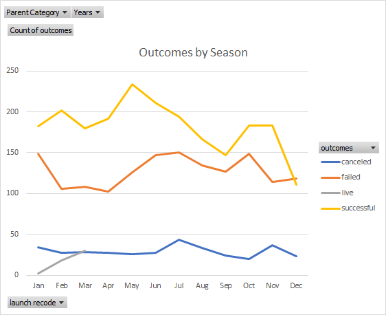

# Kickstarter-Analysis
Exploratory analysis on Kickstarter data to uncover trends
# Graphs for Report

---

---
* Failed kickstarters for plays in the US tend to have higher goals on average and lower average pledges
* All nonfiction publishing Kickstarters in the US are successful 
* I suggest you cut down your budget and try to obtain as much as you can for free
* Consider switching your project from a play to a nonfiction book 
